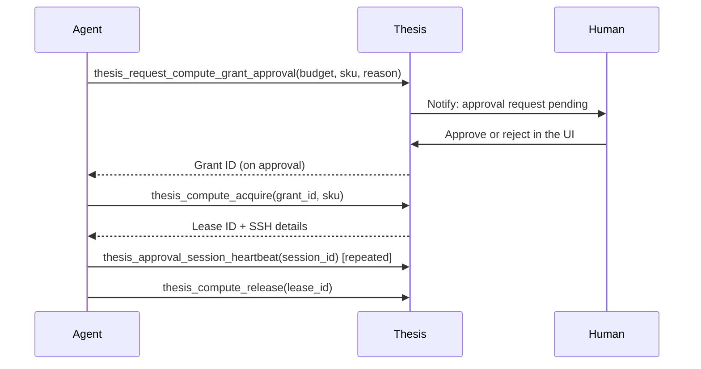

Thesis treats compute as an explicitly governed resource. Acquiring a GPU lease, spending campaign budget, or launching a code execution all require prior authorization, either through an approval session that a human grants, or through a campaign budget that caps autonomous spending. The 30 tools in this section cover the full lifecycle: checking available hardware, requesting and managing grants, orchestrating multi-step workflows, running code executions, and reading account and contract metadata.

## Compute tools (11)

Compute tools manage GPU leases from supported providers (Lambda Cloud and Modal). Before acquiring a lease, request a compute grant approval from a human reviewer. Once approved, acquire a lease by SKU and hold it open with heartbeats until your work is done.

| Tool | Mutation? | Purpose |
|---|---|---|
| `thesis_compute_list_options` | No | List available GPU SKUs and hourly rates |
| `thesis_compute_acquire` | Yes | Lease a GPU instance by SKU |
| `thesis_compute_status` | No | Check the status of an active lease |
| `thesis_compute_connection` | No | Retrieve SSH connection details for a lease |
| `thesis_compute_release` | Yes | Release a specific lease |
| `thesis_compute_release_all` | Yes | Release all active leases for your account |
| `thesis_approval_session_heartbeat` | Yes | Extend the TTL of an active approval session |
| `thesis_list_approval_sessions` | No | List all active approval sessions |
| `thesis_expire_approval_session` | Yes | Immediately end an approval session |
| `thesis_request_compute_grant_approval` | Yes | Submit a compute spending request for human approval |
| `thesis_list_compute_grants` | No | List grants associated with your account |

### Approval flow

Compute-spending actions require an explicit grant from a human approver before the agent can proceed. The sequence below shows the standard flow.

### Key parameters

<ParamField body="sku" type="string" required>
  GPU SKU identifier from `thesis_compute_list_options`, e.g. `"gpu_1x_a100_80gb"`.
</ParamField>

<ParamField body="grant_id" type="string" required>
  The grant ID returned after a human approves a `thesis_request_compute_grant_approval` request.
</ParamField>

<ParamField body="lease_id" type="string" required>
  The lease identifier returned by `thesis_compute_acquire`. Required for status, connection, and release calls.
</ParamField>

<ParamField body="session_id" type="string" required>
  The approval session ID. Send heartbeats on a regular interval to prevent the session from expiring while work is in progress.
</ParamField>

<Warning>
  Approval sessions expire automatically if heartbeats stop. Call `thesis_approval_session_heartbeat` at least once per minute during long-running compute jobs.
</Warning>

## Workflow tools (7)

Workflow tools orchestrate multi-step research procedures. A workflow has explicit progress states that agents update as they complete each step, enabling humans to inspect progress in the Thesis UI at any point.

| Tool | Mutation? | Purpose |
|---|---|---|
| `thesis_start_workflow` | Yes | Begin a new multi-step workflow |
| `thesis_get_workflow_state` | No | Retrieve current workflow state and step history |
| `thesis_update_workflow_progress` | Yes | Report completion of a workflow step |
| `thesis_complete_workflow` | Yes | Mark a workflow as finished |
| `thesis_plan_frontier` | No | Get suggested next research directions for a node |
| `thesis_check_budget` | No | Check remaining budget for a campaign or workflow |
| `thesis_should_continue` | No | Budget-aware check: returns `true` if budget allows continuation |

`thesis_plan_frontier` and `thesis_should_continue` are decision-support tools that let an agent determine what to do next without hard-coding planning logic. Use `thesis_check_budget` before any expensive step to avoid overruns.

## Campaigns tools (5)

Campaigns group related research work under a shared budget. Campaign budgets cap how much autonomous spending can occur and can be created, adjusted, or revoked as priorities change.

| Tool | Mutation? | Purpose |
|---|---|---|
| `thesis_get_campaign_snapshot` | No | Get current metrics for a campaign |
| `thesis_list_campaign_budgets` | No | List all budgets for a campaign |
| `thesis_create_campaign_budget` | Yes | Create a new budget for a campaign |
| `thesis_update_campaign_budget` | Yes | Modify an existing budget's amount or period |
| `thesis_revoke_campaign_budget` | Yes | Permanently revoke a budget |

## Execution tools (3)

Execution tools launch and manage code execution sessions tied to specific nodes. Executions run in sandboxed environments and their output is associated with the node for traceability.

| Tool | Mutation? | Purpose |
|---|---|---|
| `thesis_launch_execution` | Yes | Start a code execution for a node |
| `thesis_list_executions` | No | List all executions associated with a node |
| `thesis_terminate_execution` | Yes | Stop a running execution |

<ParamField body="node_id" type="string" required>
  The node the execution is associated with. Execution output and artifacts are linked to this node.
</ParamField>

<ParamField body="execution_id" type="string" required>
  The execution identifier, required for `thesis_terminate_execution`.
</ParamField>

## Auth & Meta tools (4)

These read-only tools let an agent inspect its own identity, check its credit balance, and read the system contract that governs agent behavior.

| Tool | Mutation? | Purpose |
|---|---|---|
| `thesis_auth_status` | No | Return the current authenticated user's info |
| `thesis_get_contract` | No | Retrieve the full system contract |
| `thesis_get_contract_section` | No | Retrieve a single named section of the contract |
| `thesis_get_credits_balance` | No | Return the current credit balance for your account |

`thesis_get_contract` and `thesis_get_contract_section` are useful for agents that need to understand the rules and boundaries that govern their Thesis session before beginning autonomous work.
